# CHAPTER 1: INTRODUCTION

## 1.1 Background
The pharmacy industry is currently undergoing a significant digital transformation. Traditional pharmacies face numerous operational challenges, including manual inventory tracking, paper-based prescription handling, inefficient stock management (leading to either overstocking or stockouts), and a distinct lack of real-time data-driven decision-making. In Egypt and the broader Middle East region, the vast majority of community pharmacies still operate with paper prescriptions, manual ledger-based inventory systems, and limited technological integration.

Simultaneously, patient expectations are rapidly evolving. The modern patient seeks unparalleled levels of convenience—specifically, the ability to submit prescriptions digitally, track order status in real time, and communicate securely with pharmacy staff without necessarily visiting the physical location.

While automation and robotic dispensing have become more accessible, they have historically been confined to large hospital environments. The lack of integrated software that connects the digital prescription pipeline from the patient directly to physical robotic hardware remains a significant hurdle for community pharmacies.

## 1.2 Literature Review
Pharmacy Management Systems (PMS) have evolved from simple inventory trackers to comprehensive enterprise platforms. Commercial solutions offer core functionalities but often lack integration with advanced analytics, robotic control, and modern patient-facing interfaces. Recent research has proposed smart pharmacy systems using IoT and RFID technology; however, these systems typically lack direct integration with mechanical robotic dispensing units.

Human-Computer Interaction (HCI) research emphasizes that pharmacy staff work in high-pressure, time-sensitive environments. Studies indicate that pharmacy staff using well-designed digital interfaces following strict HCI principles (such as Fitts's Law and Nielsen's Heuristics) reduced medication dispensing errors by up to 34% compared to traditional paper-based systems.

## 1.3 Problem Statement and Current Situation Evaluation
Community pharmacies face several interconnected problems that highlight the disadvantages of the current situation:
* **Manual Prescription Handling**: Paper prescriptions are prone to loss, misinterpretation, and inefficiency. Pharmacists must manually read handwritten scripts, leading to critical errors and delays.
* **Inventory Inefficiency**: Stock management is often done manually, resulting in expired medicines, stockouts of high-demand items, and overstocking of slow-moving products.
* **Patient Communication Gap**: Patients have no visibility into prescription status once submitted.
* **Underutilized Automation**: The software layer connecting patient orders to robotic dispensing hardware is fragmented or non-existent for community pharmacies.
* **Data Sovereignty**: Many pharmacies require on-premise deployment due to data sovereignty concerns, making cloud-only solutions unviable.

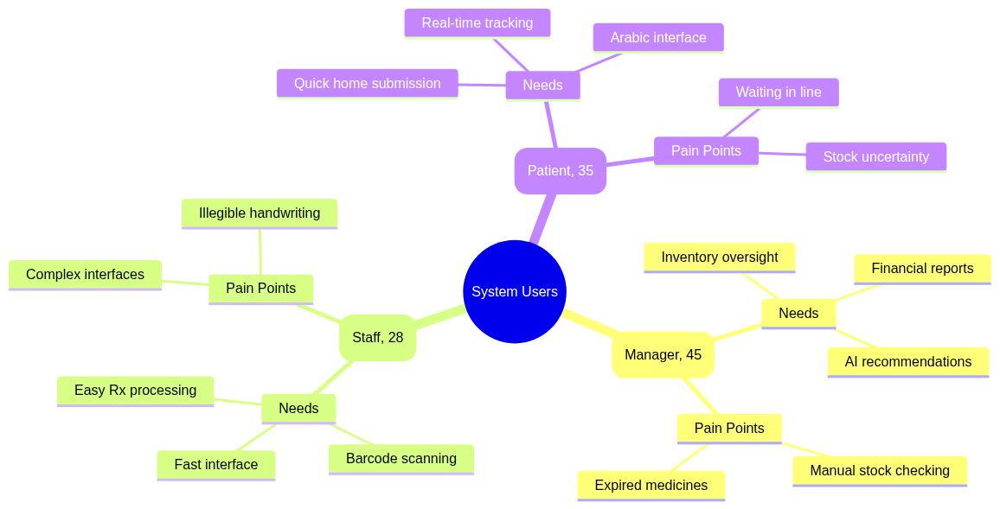

## 1.4 Importance of the Proposed Research
This research is vital as it bridges the gap between patient-facing digital prescription submission and staff-facing robotic dispensing and inventory management. By introducing a fully integrated system (APMS PharmaSys and Roshetety), this project aims to significantly reduce medication dispensing errors, optimize pharmacy inventory costs, improve patient convenience, and demonstrate how robotic hardware can be seamlessly controlled via local network interfaces in a community pharmacy setting.

## 1.5 Research Aims and Objectives
The primary objectives of this project are:
* Develop a bilingual patient mobile application (Roshetety) for prescription submission and real-time tracking.
* Build a comprehensive staff dashboard (PharmaSys) for inventory management and invoice processing.
* Create a unified backend gateway to connect frontend applications to a database and hardware interfaces.
* Implement hardware integration for a robotic dispensing arm via serial communication and real-time WebSockets.
* Ensure all data remains on-premise to respect data sovereignty and privacy requirements.

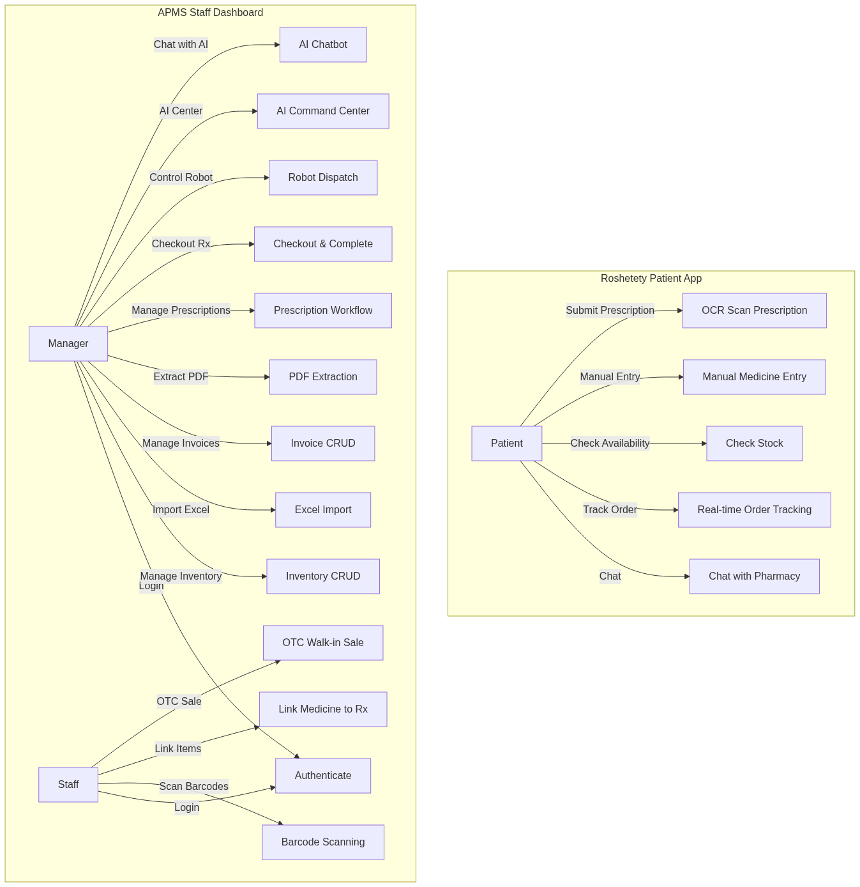

# CHAPTER 3: METHODOLOGY / THEORY / ANALYSIS

## 3.1 UI/UX and HCI Design
The UI/UX design methodology for both the PharmaSys Staff Dashboard and the Roshetety Patient Application is strictly grounded in established Human-Computer Interaction (HCI) principles. The design was informed by the specific cognitive and environmental demands of pharmacy work, such as high time pressure and frequent interruptions.

### User Research and Interviews
To ensure the interface met the operational reality of Egyptian community pharmacies, a series of structured interviews were conducted with three pharmacy managers and five pharmacy staff members. The feedback collected highlighted several core pain points:
* **High Cognitive Load**: Staff reported that existing software required too many clicks to complete a single sale, leading to user fatigue.
* **Screen Clutter**: Managers complained that crucial data (like low stock alerts) was often buried under menus.
* **Physical Constraints**: Staff often operate the software while holding physical products or talking to patients, necessitating larger click targets and keyboard-navigable workflows.

These insights directly translated into our User-Centered Design (UCD) approach. We implemented large touch targets (≥ 44px), flattened the navigation hierarchy to minimize steps for common tasks like checking out a prescription, and introduced global keyboard shortcuts to speed up high-volume data entry.

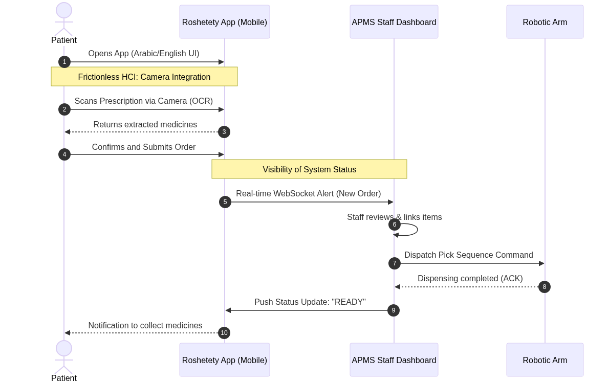

### Design System and Tokens
A comprehensive Design System was established to guarantee visual consistency and reduce development overhead. This system is driven by predefined "Design Tokens" that control color, typography, and spacing across both the staff and patient applications.
* **Typography Strategy**: The system employs a dual-font approach to support seamless bilingual (Arabic/English) interfaces. "Inter" is utilized for crisp English legibility, while "Cairo" ensures modern, highly readable Arabic text.
* **Color Palette**: The PharmaSys staff dashboard utilizes a professional "Medical Blue" primary palette (#02569B), designed to reduce eye strain during prolonged enterprise use. The Roshetety patient app utilizes a softer, more inviting aesthetic.
* **Accessibility and Status**: Status indicators rely on redundant encoding—combining color, icons, and text labels—to ensure accessibility for color-blind users (e.g., a green checkmark for in-stock, an amber triangle for low stock, a red cross for expired items).

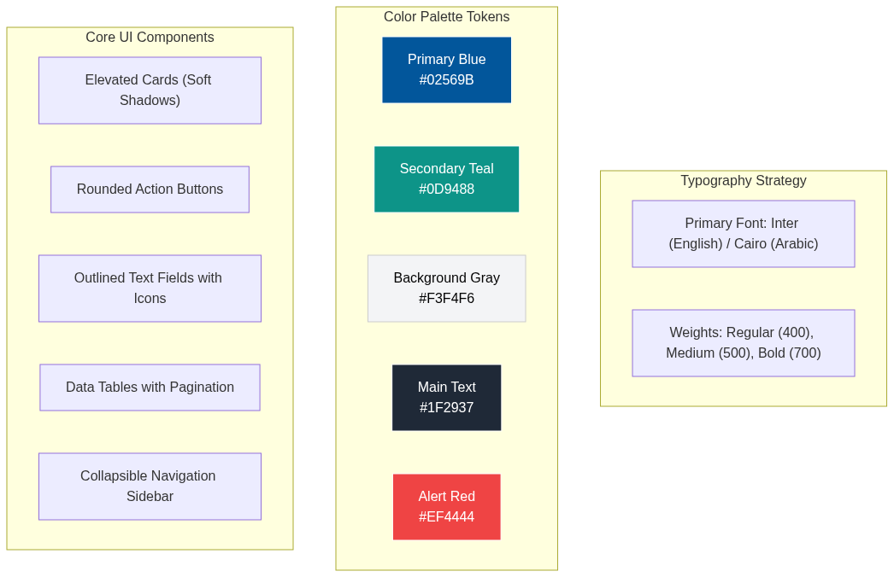

### Visibility of System Status and Navigation
Real-time indicators are used throughout the system. Key Performance Indicator (KPI) cards update dynamically, WebSocket badges show connection status, and the robot control panel displays live arm status. The navigation pattern relies on a collapsible sidebar, ensuring that the main workspace is maximized for data-heavy views.

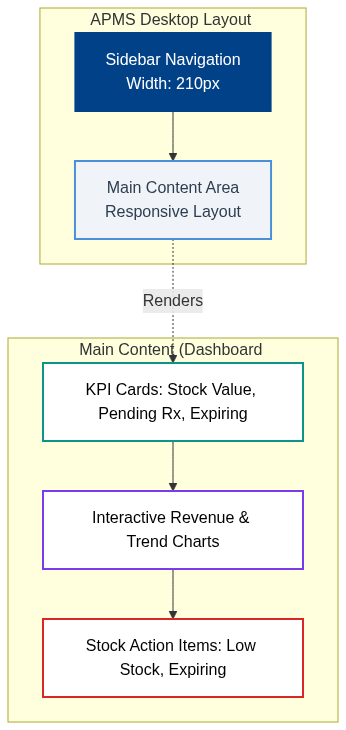

## 3.2 Frontend Implementation
The frontend is developed using Flutter (Dart), enabling natively compiled cross-platform applications from a single codebase based on Clean Architecture principles.

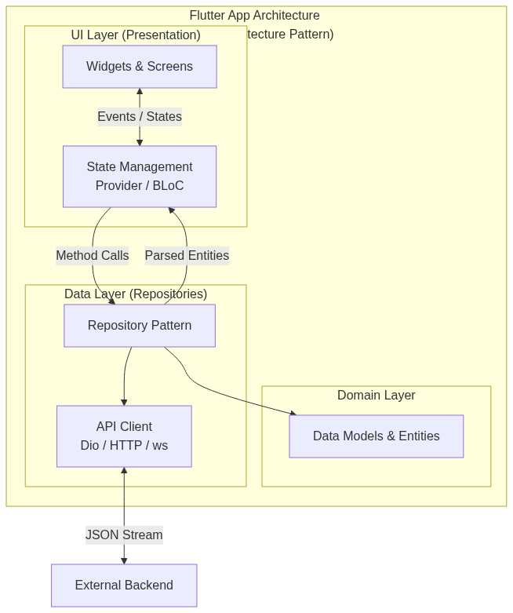

### PharmaSys Staff Dashboard
The PharmaSys app is organized into a clean, feature-based architecture. It implements a responsive design approach using `LayoutBuilder` to seamlessly switch between Desktop (multi-column grid with sidebar navigation), Tablet, and Mobile layouts.
State management is handled via Provider, ensuring lightweight and efficient UI updates. A comprehensive API Service Client manages all HTTP requests, featuring custom exception classes, timeout management, offline detection, and a dedicated WebSocket client for real-time robotic hardware updates.

### Roshetety Patient App
The patient app follows a flat navigation model optimized for minimal friction. It includes full Arabic/English bilingual support using Flutter's `Directionality` widget for Right-to-Left (RTL) layout switching. A live WebSocket connection provides patients with real-time order tracking updates (Pending → Processing → Dispensed → Ready).

## 3.3 Database Implementation
The system relies on a PostgreSQL relational database designed to guarantee data integrity, historical accuracy, and efficient querying.

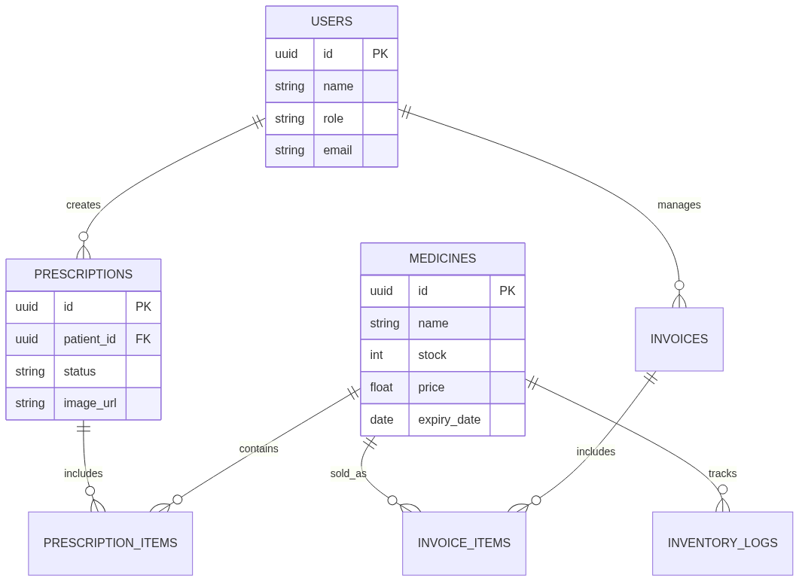

### Database Schema
The schema comprises core tables designed for normalized efficiency:
* `users`: Manages staff authentication and role-based access.
* `medicines_inventory`: The central repository tracking trade names, active substances, stock levels, costs, and expiration dates.
* `invoices_fawateer` & `invoice_items`: Tracks supplier deliveries and financial payables.
* `prescriptions` & `prescription_items`: Manages patient orders, linking requested items directly to the physical inventory.

The database is accessed via the `pg` (node-postgres) driver utilizing connection pooling to ensure high-throughput performance during peak pharmacy hours.

## 3.4 Backend Implementation
The backend gateway is built using Node.js and Express 5.x with TypeScript, adopting a modular three-tier microservices architecture. It acts as the central hub connecting the Flutter frontends, the PostgreSQL database, and the physical hardware.

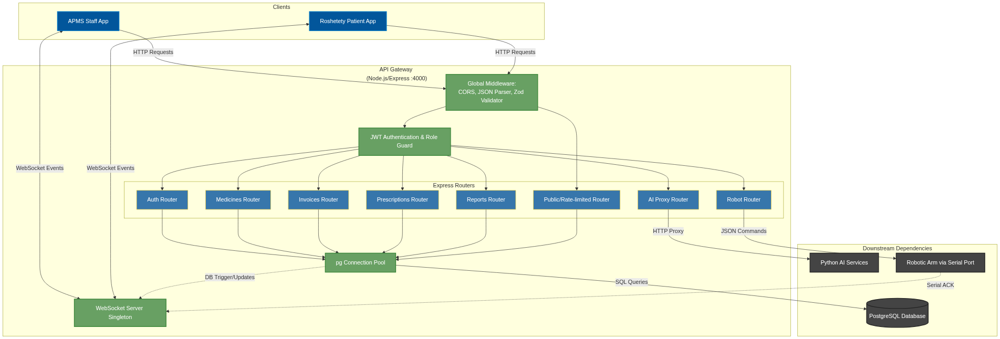
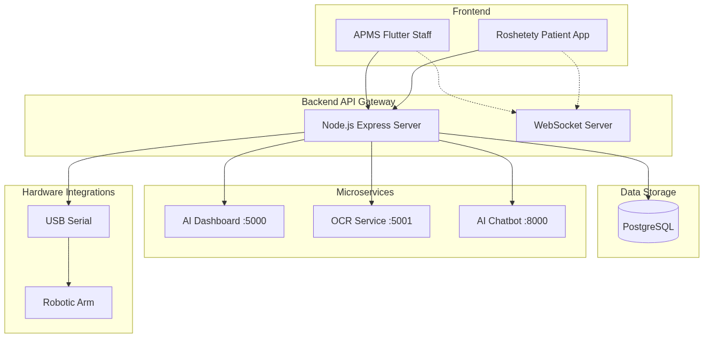

### API Gateway Architecture
The Express server features a modular router architecture separating concerns (Auth, Medicines, Invoices, Prescriptions, Robot).
* **Authentication & Security**: Implemented via JSON Web Tokens (JWT) and `bcryptjs` for password hashing. Role Guards strictly differentiate between Staff and Manager endpoints.
* **Validation**: Request body validation is strongly typed using the `zod` library.
* **File Processing**: Utilizes `multer` for multipart uploads and `xlsx` for bulk Excel data imports.

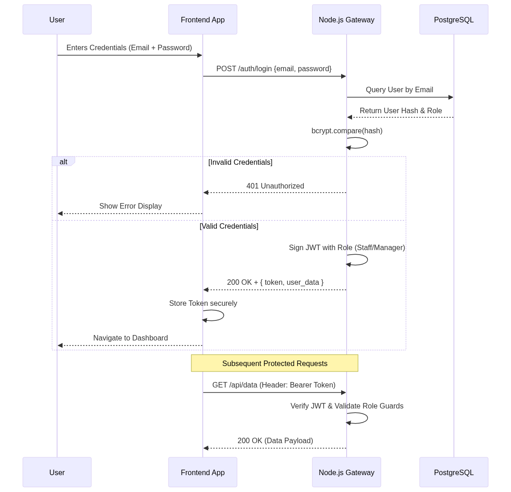

## 3.5 Integrations (Hardware & Real-time Synchronization)
A critical component of this methodology is the seamless integration between software logic and external/hardware services.

### Real-Time Synchronization via WebSockets
A standalone WebSocket server operates alongside the HTTP server to broadcast real-time events. For example, when a bulk inventory upload occurs via the fallback Google Sheets bridge, the backend parses the CSV, validates it, and triggers a WebSocket broadcast. This allows the staff dashboard to instantly refresh the inventory view without manual page reloads.

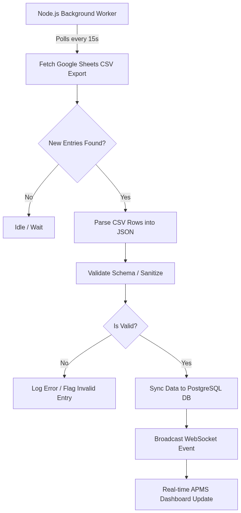
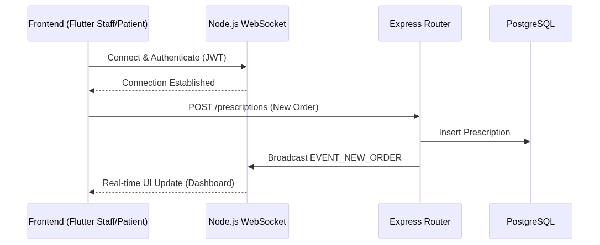

### Robotic Arm Hardware Integration
The backend integrates directly with a robotic dispensing arm via a USB Serial Port (RS-232).
When pharmacy staff dispatch a prescription, the backend generates a specific JSON pick sequence. This payload is transmitted over the serial port using the `serialport` Node.js package. The Arduino Mega micro-controller processes the command, drives the stepper motors to the specified bin, dispenses the medicine, and sends an Acknowledgment (ACK) back through the serial interface. The Node.js server receives this ACK, updates the PostgreSQL database, and instantly broadcasts the status change via WebSockets to both the staff dashboard and the patient's mobile app.

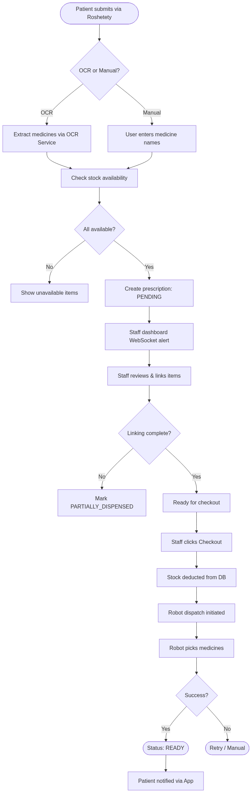
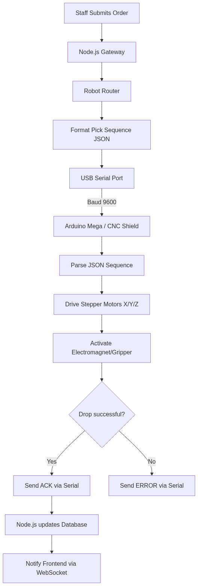
